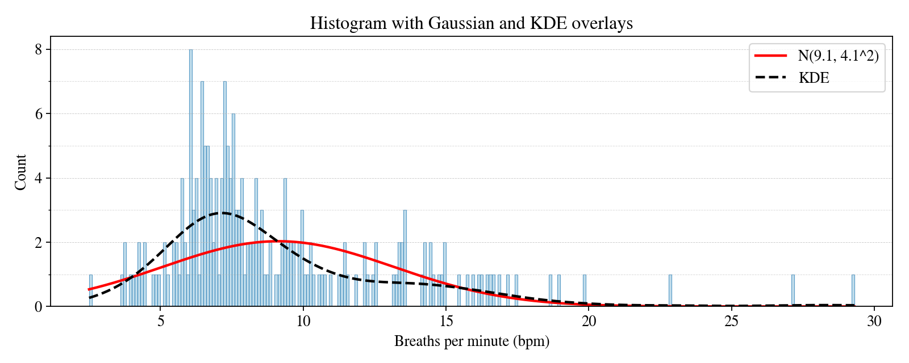
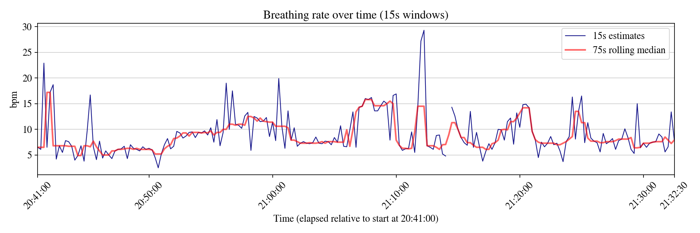
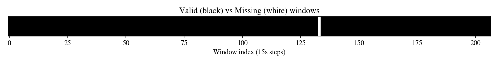

# Breathing Rate Estimation

## Quick Links

### Requested Links

- [Final 15s Output CSV](./output/breathing_rate_15s_final.csv)
- [Computation Script (`compute_breathing_rate_final.py`)](./src/compute_breathing_rate_final.py)

### Additional Helpful Links

- [Appendix Notebook (EDA & Figures)](./notebooks/appendix_breathing_rate_eda.ipynb)
- [Mathematical Notes Notebook (`math_notes.ipynb`)](./notebooks/math_notes.ipynb)

---

## Output Requirements (as specified by Farzad Ehsani)

- CSV with two columns:
  - time: HH:MM:SS, localized to PDT
  - bpm: breaths per minute, rounded to 1 decimal place
- Standalone Python script:
  - Recomputes the CSV from raw JSON logs
  - Clear, commented code explaining the pipeline

---

## Methodology

1) Reconstruct RR interval stream
   - Remove implausible intervals (0.3–2.0 s).
   - Resample to a uniform 4 Hz grid to enable FFT on evenly spaced data.

2) Bandpass filtering (0.1–0.5 Hz)
   - Isolate the physiological breathing band (6–30 bpm).
   - Suppress low-frequency drift and high-frequency noise.

3) Windowed FFT with peak refinement
   - Split the signal into 15 s windows.
   - Apply a Hann window; compute FFT.
   - Identify the dominant peak within 0.1–0.5 Hz.
   - Refine peak frequency via parabolic interpolation.
   - Convert to breaths per minute (bpm).

4) Validity checks and output
   - Require sufficient data coverage and peak prominence.
   - Mark invalid windows as NaN.
   - Export to CSV.

---

## Why This Approach?

- Physiological grounding: respiratory sinus arrhythmia links breathing to HRV, so the IBI signal carries respiratory-rate content (see Applied/Phys references below).
- FFT fit: after resampling, respiration appears as a narrowband component. Hann windowing reduces leakage; parabolic interpolation gives sub-bin accuracy with short windows.
- Practical tradeoffs: 15 s windows balance temporal resolution and spectral stability. The pipeline is fast, transparent, and reproducible.

---

## Mathematical Notes (GitHub-safe summary)

For full LaTeX derivations, see the Jupyter notebook:
notebooks/math_notes.ipynb

FFT power spectrum (normalized)  
P(f) = |X(f)|^2 / (sum w[n]^2 * fs)

Frequency resolution  
df = fs / N  
(Zero-padding increases the number of FFT bins and refines the grid used for interpolation.)

Parabolic peak interpolation  
delta = 0.5 * (y[-1] - y[+1]) / (y[-1] - 2*y[0] + y[+1])  
f_est = f0 + delta * df  
(This provides sub-bin frequency estimates, important for 15 s windows.)

---

## Exploratory Data Analysis (EDA)

The appendix notebook (notebooks/appendix_breathing_rate_eda.ipynb) includes:
- Histograms with Gaussian and KDE overlays
- Full-session time series with rolling median
- Missingness analysis (run-lengths and strip plots)
- Outlier detection with the 3xIQR rule
- Summaries of quality and key statistics

### Example Figures

Below are representative outputs from the EDA process:

**Histogram of 15s Breathing Rates (with KDE overlay)**  

**Full-Session Breathing Rate Time Series**  

**Heatmap of Valid Data Coverage**  

---

## Conclusions

- Produces reproducible breathing-rate estimates at 15 s resolution.
- FFT-based estimation is physiologically grounded and mathematically justified.
- Deliverables are transparent, auditable, and easy to re-run.

---

## Limitations & Future Work

- Motion artifacts: RR intervals can be corrupted by movement; accelerometer-informed cleaning could help.
- Transients: rapid changes (sighs, speech) break stationarity; wavelets or EMD may improve tracking.
- Validation: concurrent reference respiration (capnography, belts) would strengthen accuracy claims.
- Adaptive parameters: band limits and prominence thresholds could be tuned per subject or state.
- Overlapping windows: 50% overlap may increase temporal resolution while keeping spectral reliability.

---

## Bibliography

### Applied / Physiological References
| Ref | Citation | Notes |
|-----|----------|-------|
| [1] | Task Force of the European Society of Cardiology. Heart rate variability: Standards of measurement, physiological interpretation and clinical use. Circulation, 1996. | HRV frequency bands; HF band aligns with respiration. |
| [2] | Schäfer, A., & Kratky, K. W. Estimation of breathing rate from respiratory sinus arrhythmia: Comparison of various methods. Ann. Biomed. Eng., 2008. | Compares respiration estimators from HRV, including FFT. |
| [3] | Bailón, R., et al. Analysis of respiratory frequency from heart rate variability. IEEE TBME, 2006. | HRV-derived respiration validated vs reference signals. |

### Mathematical / DSP References
| Ref | Citation | Notes |
|-----|----------|-------|
| [4] | Harris, F. J. On the use of windows for harmonic analysis with the DFT. Proc. IEEE, 1978. | Window design, leakage, practical guidance. |
| [5] | Quinn, B. G. Estimating frequency by interpolation using Fourier coefficients. IEEE TSP, 1994. | Theory of sub-bin interpolation. |
| [6] | Oppenheim, A. V., & Schafer, R. W. Discrete-Time Signal Processing. 3rd ed., 2009. | Core DSP: FFT assumptions, windowing, spectral estimation. |
| [7] | Stoica, P., & Moses, R. Spectral Analysis of Signals. 2005. | Spectral estimation, modified periodograms, PSD theory. |
| [8] | Lyons, R. G. Understanding Digital Signal Processing. 3rd ed., 2010. | Practical treatment of FFT, windows, interpolation. |
| [9] | Rife, D. C., & Vincent, G. A. Use of the DFT in the measurement of frequencies and levels of tones. Bell Syst. Tech. J., 1970. | Early, practical frequency estimation from DFT bins. |
| [10] | Jacobsen, E., & Kootsookos, P. Fast, accurate frequency estimators. IEEE Signal Processing Magazine, 2007. | Survey of parabolic and related estimators. |
| [11] | Welch, P. The use of FFT for the estimation of power spectra. IEEE Trans. Audio Electroacoust., 1967. | Periodograms and PSD estimation. |
